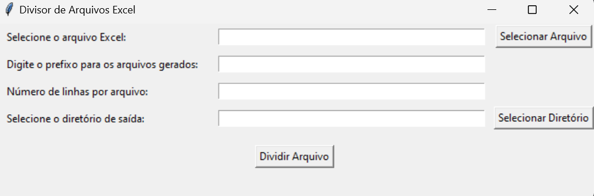

# Aplicativo para Divisão de Arquivos Excel

## **Problema**

Imagine que você possui uma limitação de 30 MB para upload de arquivos, mas o cliente enviou dois arquivos Excel de 40 MB, ultrapassando esse limite.

Este aplicativo foi desenvolvido para dividir arquivos Excel grandes em partes menores, facilitando o carregamento.

## **Descrição do Aplicativo**

Este aplicativo:

- Divide arquivos Excel grandes em várias partes com base no número de linhas por arquivo definido por você.
- Salva automaticamente os arquivos gerados na pasta de sua escolha.
- Valida os inputs do usuário para garantir que os arquivos sejam divididos corretamente.
- Desabilita o botão de divisão durante a execução para evitar cliques múltiplos.

### **Exemplo**

**Entrada:** Um Excel com 180.000 linhas, configurado para 90.000 linhas por arquivo.  
**Saída:** 2 arquivos:
- Arquivo 1: 90.000 linhas
- Arquivo 2: 90.000 linhas restantes

Se configurado para 150.000 linhas por arquivo, o resultado seria:

- Arquivo 1: 150.000 linhas
- Arquivo 2: 30.000 linhas restantes

## **Requisitos**

Não há necessidade de instalação prévia, pois o aplicativo foi convertido em um arquivo `.exe`. Para usá-lo, basta seguir as instruções abaixo.

## **Passo a Passo para Usar o Aplicativo**

### 1. **Execute o Aplicativo**

Baixe e abra o arquivo `main.exe`. Não será necessário instalar o Python ou pacotes adicionais.

### 2. **Siga as Instruções Interativas**

- **Caminho do arquivo Excel:** Informe o caminho completo (ex.: `C:\MeusArquivos\planilha.xlsx`) ou apenas o nome do arquivo Excel se ele estiver na mesma pasta do `.exe`.
- **Prefixo para os arquivos gerados:** Escolha um nome base para os arquivos divididos (ex.: `Teste`).
- **Número de linhas por arquivo:** Defina a quantidade de linhas que cada arquivo gerado terá (ex.: 90.000).
- **Pasta de saída:** Escolha o local onde os arquivos divididos serão salvos.

### 3. **Aguarde o Processamento**

Os arquivos gerados serão salvos na pasta de saída escolhida, com nomes como:

- `Teste_SheetName_1.xlsx`
- `Teste_SheetName_2.xlsx`
- E assim por diante, conforme a quantidade de arquivos gerados.

### 4. **Finalização**

Após o processamento, uma mensagem de sucesso será exibida, informando que os arquivos foram gerados corretamente.

### **Exemplo de Resultado**

Após executar o aplicativo, se você tiver um arquivo Excel de 18 MB e configurado para dividir em 9.000 linhas por arquivo, dois arquivos serão gerados, cada um com aproximadamente 9 MB.

## **Conclusão**

Este aplicativo foi desenvolvido para facilitar a divisão de arquivos Excel grandes em partes menores, permitindo que você carregue esses arquivos em sistemas com limitações de tamanho.

