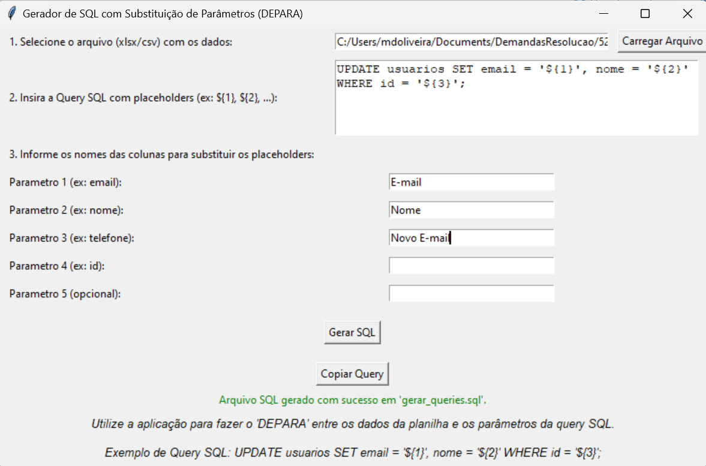

# **Gerador de SQL com Substituição de Parâmetros**

Este aplicativo foi desenvolvido para gerar consultas SQL automaticamente a partir de dados de planilhas (Excel/CSV), substituindo parâmetros dinâmicos em um template de SQL. Ele facilita a criação de consultas SQL para múltiplas linhas de dados, otimizando o processo e reduzindo a chance de erros.

## **Caso de Uso**

Imagine que você possui uma planilha Excel ou CSV com dados que precisam ser inseridos em um banco de dados por meio de consultas SQL. Escrever manualmente essas consultas SQL para cada linha de dados seria demorado e propenso a erros.

Além disso, a consulta SQL que você precisa usar contém parâmetros dinâmicos que variam conforme os dados da planilha, como IDs, nomes e e-mails. Este aplicativo facilita esse processo ao gerar automaticamente as consultas SQL, substituindo os parâmetros definidos no template da consulta SQL pelos valores contidos nas colunas da planilha.

## **Funcionalidades**

- **Carregar arquivos .xlsx ou .csv:** O aplicativo permite que você carregue arquivos Excel ou CSV contendo os dados a serem utilizados.
- **Definir template de consulta SQL com placeholders:** Insira a consulta SQL com placeholders (ex.: `${1}`, `${2}`, ...) que serão substituídos pelos valores das colunas da planilha.
- **Mapear as colunas da planilha para os parâmetros da consulta SQL:** Associe os parâmetros da consulta SQL aos nomes das colunas da planilha.
- **Gerar e salvar um arquivo .sql com as consultas geradas:** O aplicativo cria um arquivo `.sql` contendo todas as consultas geradas para cada linha da planilha.
- **Copiar uma consulta de exemplo para a área de transferência:** Copie facilmente uma consulta SQL de exemplo para utilizar em seu banco de dados.
- **Sugerir correções automáticas:** Caso algum parâmetro não corresponda a uma coluna da planilha, o aplicativo sugerirá correções automáticas.

## **Como Usar**

### 1. **Carregar Excel/Csv**

Clique no botão **Carregar Arquivo** para selecionar um arquivo `.xlsx` ou `.csv` contendo os dados a serem usados.

### 2. **Inserir Template de Query SQL**

Na caixa de texto, insira a consulta SQL com placeholders. Exemplo:
```sql
UPDATE usuarios SET email = '${1}', nome = '${2}' WHERE id = '${3}';
```

### 3. **Informar os Parâmetros**

Preencha os campos **Parametro 1** até **Parametro 5** com os nomes das colunas da planilha que correspondem aos placeholders. Esses parâmetros serão substituídos pelos valores das colunas na consulta SQL.

### 4. **Gerar SQL**

Clique no botão **Gerar SQL** para gerar o arquivo `.sql` com as consultas.

### 5. **Copiar Query de Exemplo**

Clique em **Copiar Query** para copiar uma consulta SQL de exemplo para a área de transferência.

### 6. **Aplicar Correções (Opcional)**

Caso algum parâmetro não seja encontrado na planilha, o aplicativo sugerirá correções automáticas. Você pode aplicar as correções clicando em **Aplicar Correções**.

## **Como Rodar**

Execute o aplicativo clicando no arquivo executável.

## **Imagem do Aplicativo**



## **Observações**

Este aplicativo foi criado para facilitar a geração de consultas SQL a partir de planilhas, com foco na substituição de parâmetros dinâmicos. É possível que você precise ajustar os nomes das colunas ou fazer correções, caso o nome de algum parâmetro não seja encontrado na planilha.